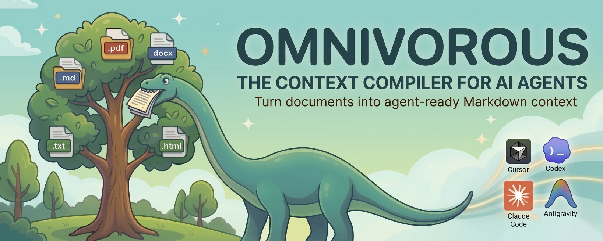

# omnivorous



> Turn your documents into agent-ready Markdown context.

omnivorous converts PDF, DOCX, HTML, Markdown, and plain text files into clean, structured Markdown that AI coding agents can consume directly. It handles format-specific cleanup, extracts metadata, counts tokens, chunks documents intelligently, and builds navigation and relationship files that help agents read less and find the right context faster.

## Install

```bash
pip install omnivorous
```

Or with [uv](https://docs.astral.sh/uv/):

```bash
uv tool install omnivorous
```

This makes the `omni` command available globally.

For scientific documents with LaTeX formula extraction:

```bash
pip install omnivorous[scientific]
```

## Quick Start

```bash
# Generate a full agent context pack (defaults to Claude Code)
omni pack docs/ -o agent-context/

# Generate for a specific agent
omni pack docs/ --agent codex
omni pack docs/ --agent cursor

# Generate for multiple agents at once
omni pack docs/ --agent claude --agent codex --agent copilot

# Generate for all supported agents
omni pack docs/ --agent all
```

## How It Works

omnivorous processes documents through a four-stage pipeline:

1. **Convert** — Each format has a dedicated converter that produces clean Markdown. PDFs use pymupdf4llm for accurate layout extraction with ligature repair and header/footer removal (or marker-pdf in `--mode scientific` for LaTeX formula reconstruction); HTML gets nav, script, and boilerplate stripping; DOCX preserves structure while dropping styling.
   When processing folders, omnivorous converts files in parallel by default where it is safe to do so.
2. **Extract metadata** — Page count, headings, tables, and token count are recorded as YAML frontmatter.
3. **Pack** — Agent instruction files, a project context map, a chunk-aware manifest, chunked docs, full converted docs, and deterministic cross-document relationship hints are assembled into a ready-to-use context pack.

## Supported Formats

- PDF (`.pdf`)
- Word (`.docx`)
- HTML (`.html`, `.htm`)
- Markdown (`.md`, `.markdown`)
- Plain text (`.txt`)

## Commands

All commands accept `--encoding` to select the tiktoken encoding used for token counting (default: `o200k_base`) and `--mode` / `-m` to select the PDF conversion engine.

### `omni pack <folder>`
Generate a full agent context pack with:
- Agent instruction file (varies by target agent)
- `PROJECT_CONTEXT.md` — Documentation map, navigation hints, and cross-document bridges
- `manifest.json` — Chunk-aware file manifest with deterministic relationship metadata
- `docs/chunks/` — Focused context for agents
- `docs/full/` — Full converted documents for fallback reading

```bash
# Generate for a specific agent
omni pack docs/ --agent codex
omni pack docs/ --agent cursor

# Generate for multiple agents at once
omni pack docs/ --agent claude --agent codex --agent copilot

# Generate for all supported agents
omni pack docs/ --agent all
```

Options:
- `-o, --output`: Output directory for agent context
- `-a, --agent`: Target agent(s) — can be specified multiple times (default: `claude`)
- `-m, --mode`: PDF conversion mode — `fast` (default, pymupdf4llm) or `scientific` (marker-pdf with LaTeX formula extraction)
- `--chunk-size`: Target chunk size in tokens (default: 500)
- `--chunk-by`: Strategy — `heading` or `tokens` (default: heading)
- `--encoding`: Tiktoken encoding name (default: `o200k_base`)

#### Supported Agents

| Agent | Key | Generated File |
|-------|-----|----------------|
| Claude Code | `claude` | `CLAUDE.md` |
| Codex  | `codex` | `AGENTS.md` |
| Cursor | `cursor` | `.cursor/rules/omnivorous.md` |
| GitHub Copilot | `copilot` | `.github/copilot-instructions.md` |
| Google Antigravity | `antigravity` | `.agent/skills/omnivorous.md` |

Use `--agent all` to generate instruction files for every supported agent at once.

### `omni ingest <folder>`
Scan a folder and convert all supported documents.

```bash
omni ingest docs/ -o output/
```

Options:
- `-o, --output`: Output directory
- `-m, --mode`: PDF conversion mode — `fast` (default) or `scientific`
- `--encoding`: Tiktoken encoding name (default: `o200k_base`)

### `omni convert <file>`
Convert a single document to Markdown with YAML frontmatter.

```bash
omni convert document.pdf -o output.md

# Use a different token encoding
omni convert document.pdf --encoding cl100k_base -o output.md

# Use scientific mode for LaTeX formulas
omni convert paper.pdf --mode scientific -o output.md
```

Options:
- `-o, --output`: Output file path
- `-m, --mode`: PDF conversion mode — `fast` (default) or `scientific`
- `--encoding`: Tiktoken encoding name (default: `o200k_base`)

### `omni inspect <file>`
Display document metadata: pages, headings, tables, token count, and encoding.

```bash
omni inspect document.pdf

# Use a different token encoding
omni inspect document.pdf --encoding cl100k_base
```

Options:
- `-m, --mode`: PDF conversion mode — `fast` (default) or `scientific`
- `--encoding`: Tiktoken encoding name (default: `o200k_base`)

## PDF Conversion Modes

omnivorous supports two PDF conversion engines, selected via the `--mode` / `-m` flag:

| Mode | Use case | ML required |
|------|----------|-------------|
| `fast` (default) | General documents — accurate layout, tables, ligature repair, header/footer removal | No |
| `scientific` | Research papers — LaTeX formula reconstruction (`$...$`, `$$...$$`), advanced layout analysis | Yes (lightweight, not a VLM) |

The `scientific` mode requires the optional `[scientific]` extra:

```bash
pip install omnivorous[scientific]
```

## Token Encoding

Token counts vary across models because each uses a different tokenizer. By default, omnivorous uses `o200k_base` (GPT-4o, o1, o3). You can switch to `cl100k_base` (GPT-4 / GPT-3.5) with the `--encoding` flag.

Supported encodings:
- `o200k_base` — GPT-4o, o1, o3 (default)
- `cl100k_base` — GPT-4, GPT-3.5

The encoding name is recorded in each document's metadata so downstream tools know which tokenizer was used.

## Development

[uv](https://docs.astral.sh/uv/) is required for development.

### Setup

```bash
uv sync --extra dev
```

This installs all runtime dependencies plus dev tools (pytest, pytest-cov, ruff).

### Running Tests

```bash
uv run pytest                              # Run full test suite
uv run pytest tests/test_converters/test_pdf.py  # Run a specific test module
uv run pytest -v                           # Verbose output
uv run pytest --cov=src/omnivorous         # With coverage report
```

Test fixtures live in `tests/fixtures/`.

### Linting

```bash
uv run ruff check src/                     # Check for lint issues
uv run ruff check src/ --fix               # Auto-fix lint issues
```

### CI

CI runs tests, linting, and builds across Python 3.10–3.13 on every push to `main` and on pull requests.

## License

MIT
