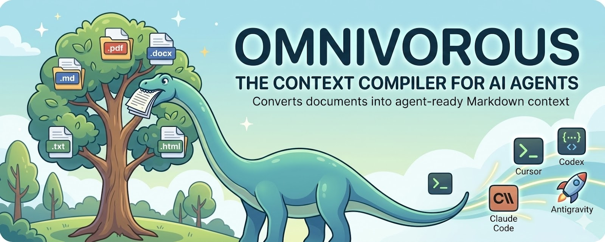

# agentmd



Convert documents into agent-ready Markdown context for AI coding agents.
All documents, AI ready
Locally feed your agents
The ingestion layer for AI agents
The context compiler for AI agents

## Install

```bash
pip install agentmd
```

## Quick Start

```bash
# Generate a full agent context pack
agentmd pack docs/ -o agent-context/

# Convert all files in a folder
agentmd ingest docs/ -o output/

# Inspect a document
agentmd inspect document.pdf

# Convert a single file
agentmd convert document.pdf -o output.md

# Use a different token encoding (default: o200k_base)
agentmd inspect document.pdf --encoding cl100k_base
agentmd convert document.pdf --encoding cl100k_base -o output.md
```

## Supported Formats

- PDF (`.pdf`)
- Word (`.docx`)
- HTML (`.html`, `.htm`)
- Markdown (`.md`, `.markdown`)
- Plain text (`.txt`)

## Commands

All commands accept `--encoding` to select the tiktoken encoding used for token counting (default: `o200k_base`).

### `agentmd pack <folder>`
Generate a full agent context pack with:
- `CLAUDE.md` — Agent instructions
- `PROJECT_CONTEXT.md` — Documentation summary
- `manifest.json` — File manifest
- `docs/` — Converted and chunked documents

Options:
- `-o, --output`: Output directory for agent context
- `--chunk-size`: Target chunk size in tokens (default: 500)
- `--chunk-by`: Strategy — `heading` or `tokens` (default: heading)
- `--encoding`: Tiktoken encoding name (default: `o200k_base`)

### `agentmd ingest <folder>`
Scan a folder and convert all supported documents.

Options:
- `-o, --output`: Output directory
- `--encoding`: Tiktoken encoding name (default: `o200k_base`)

### `agentmd convert <file>`
Convert a single document to Markdown with YAML frontmatter.

Options:
- `-o, --output`: Output file path
- `--encoding`: Tiktoken encoding name (default: `o200k_base`)

### `agentmd inspect <file>`
Display document metadata: pages, headings, tables, token count, and encoding.

Options:
- `--encoding`: Tiktoken encoding name (default: `o200k_base`)

## Token Encoding

Token counts vary across models because each uses a different tokenizer. By default, agentmd uses `o200k_base` (GPT-4o, o1, o3). You can switch to `cl100k_base` (GPT-4 / GPT-3.5) with the `--encoding` flag.

Supported encodings:
- `o200k_base` — GPT-4o, o1, o3 (default)
- `cl100k_base` — GPT-4, GPT-3.5

The encoding name is recorded in each document's metadata so downstream tools know which tokenizer was used.

## Development

```bash
uv sync
uv run pytest
uv run ruff check src/
```

## License

MIT
